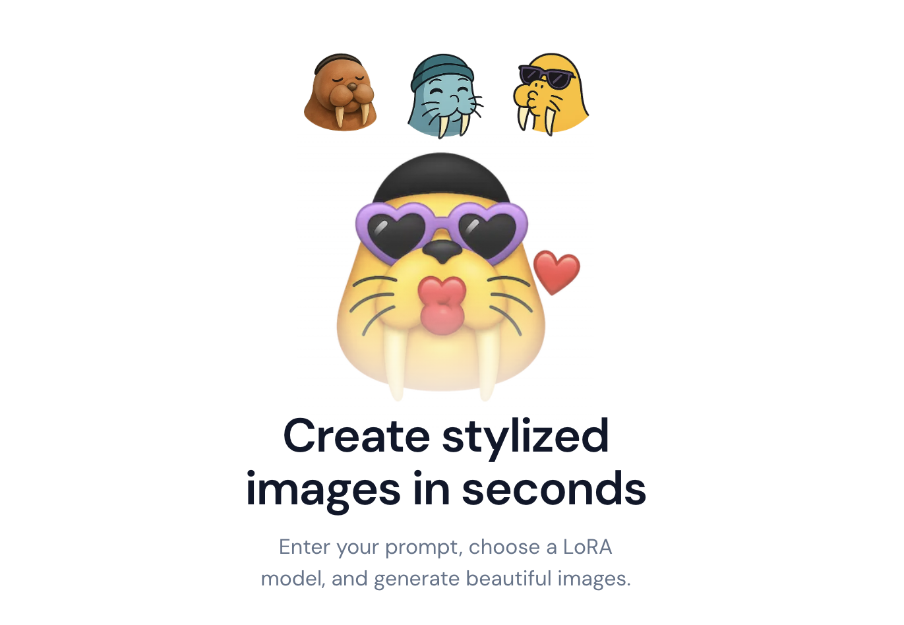

<a href="https://www.kissyface.xyz">
  
  <h1 align="center">kissyface.xyz</h1>
</a>

  An open source real-time AI image generator. Powered by Flux through Together.ai.

## Tech stack

- [Flux Dev](https://togetherai.link/together-flux/) from BFL for the image model
- [Together AI](https://togetherai.link) for inference
- Next.js app router with Tailwind
- Helicone for observability
- Plausible for website analytics

## Cloning & running

1. Clone the repo: `git clone https://github.com/Nutlope/loras-dev`
2. Create a `.env.local` file and add your [Together AI API key](https://togetherai.link): `TOGETHER_API_KEY=`
3. Run `npm install` and `npm run dev` to install dependencies and run locally
